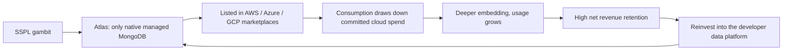

# The Multi-Cloud Moat: How MongoDB Turned Its Enemies Into a Sales Force

*The inside story of MongoDB's hyper-growth era — how a radical licensing gambit
defused an existential threat, how the Atlas consumption flywheel drove an
historic revenue explosion, and what changes when an open-source disruptor finally
grows up.*

> **The thesis in one breath**
>
> - **The threat:** under the AGPLv3, the cloud giants could resell MongoDB's own
>   engine as a managed service and keep the margin. By 2018 that was existential.
> - **The gambit:** the **SSPL** (Oct 16, 2018) made reselling MongoDB-as-a-service
>   legally impossible without open-sourcing your entire cloud stack — so the
>   hyperscalers couldn't host it, only emulate it or co-sell **Atlas**.
> - **The payoff:** Atlas became the *only* native managed MongoDB, and a
>   consumption-plus-marketplace flywheel grew it from **39% to 70% of revenue**
>   (~$162.5M to ~$1.4B) — turning competitors into a distribution channel.

---

## Cold open: the database that wasn't supposed to make money

For most of the 2010s, MongoDB occupied a strange and precarious place in the
software industry. Developers loved it. Wall Street didn't trust it. And the
largest cloud companies on earth were quietly preparing to eat it.

The love was real and measurable. Born in 2007 inside a New York startup called
10gen — founded by DoubleClick alumni Dwight Merriman, Eliot Horowitz, and Kevin
Ryan, who had spent years fighting relational databases that couldn't keep up with
ad-serving scale — MongoDB's document model gave developers something visceral:
the database finally looked like the objects in their code. You stored a thing the
way you thought about the thing. No rigid schema, no migration ceremony, no
impedance mismatch. By the time the company renamed itself MongoDB Inc. in 2013 and
went public on NASDAQ in October 2017, it sat at or near the top of every
developer-popularity ranking that mattered.

But popularity is not a business, and an open-source database is not obviously a
*defensible* one. The same openness that drove adoption also meant the code was
free for anyone to take — including the only competitors with the balance sheets to
turn that code into a fortune. This is the story of how MongoDB stared down that
contradiction, rewrote the rules of engagement, and converted a five-year window of
mortal danger into one of the most resilient moats in modern enterprise software.

---

## Part I — The trap: the open-source dilemma

To understand the magnitude of what came next, you have to understand how close
MongoDB came to a classic open-source tragedy.

In the early 2010s, MongoDB's Community Edition shipped under the **GNU AGPLv3**.
For adoption, this was rocket fuel. Anyone could download it, build on it, ship on
it, and never speak to a salesperson. That frictionless distribution is exactly how
MongoDB became ubiquitous.

The trouble is that ubiquity attracts landlords. Cloud providers around the world —
the big US hyperscalers, but, as MongoDB pointedly noted at the time, especially
several Asia-based clouds — watched the groundswell and saw an opening. Under the
AGPLv3, nothing stopped a provider from taking MongoDB's freely available engine,
wrapping it in proprietary automation, billing, and operations, and reselling it as
a slick managed service. The customer would get "MongoDB." The provider would keep
the margin.

The asymmetry was brutal, and it is worth stating in plain accounting terms:

- **MongoDB** carried the entire cost of inventing and maintaining the engine —
  years of R&D, a global engineering organization, the long tail of bug fixes and
  performance work that never makes a press release.
- **The hyperscalers** stood to harvest the high-margin operational profits of
  *running* that engine at scale, contributing little code and paying no commercial
  license.

Whoever monetizes a technology most effectively tends to end up owning it. By 2018,
the existential question was no longer hypothetical: if AWS could make more money
selling MongoDB than MongoDB could, the company's enterprise runway would be
quietly strangled — not by a better product, but by a better distribution position.

---

## Part II — The gambit: weaponizing the SSPL

On **October 16, 2018**, MongoDB did something that scandalized the open-source
purists and, in hindsight, saved the company. It abandoned the AGPLv3 and published
a brand-new license of its own design: the **Server Side Public License (SSPL)**.

The SSPL was not a general philosophical statement. It was a guided munition with a
single category of target. For ordinary developers building ordinary applications,
nothing changed — the database stayed free. But the license inserted a precise legal
tripwire for anyone trying to monetize MongoDB *as a service*.

> **SSPL, Section 13 (in essence):** If you offer the functionality of the software
> to third parties as a managed service, you must release — publicly, for free — the
> complete source code of *everything you use to provide that service.*

Read that again, because the phrase "everything you use" is the whole weapon. It
doesn't mean open-sourcing your patches to the database. It means open-sourcing the
**management plane**: the orchestration and automation layer, the metering and
billing systems, the monitoring and security wrappers, the backup and storage
subsystems. The proprietary machinery that *is* a hyperscaler's cloud business.

For AWS, Google, and Microsoft, opening that hood was a non-starter — not a hard
negotiation, an impossibility. Those subsystems are multi-tenant, deeply
entangled, foundational IP. You cannot carve out "the part that runs MongoDB" and
publish it without effectively publishing how your cloud works.

### The fork in the industry

The maneuver had immediate, structural consequences. There was real fallout, too:
MongoDB **submitted the SSPL to the Open Source Initiative for approval, then
withdrew the submission in 2019** — the license has never been OSI-approved — and
several Linux distributions, including Red Hat/Fedora and Debian, dropped MongoDB
from their repositories over the change. MongoDB accepted that reputational cost
deliberately. In exchange, the market split into two roads:

1. **The hyperscalers were forced to emulate, not host.** Unable to ship the real
   engine, AWS built a workaround and launched **Amazon DocumentDB on January 9,
   2019** — *not* native MongoDB, but an emulation layer that reimplements the
   MongoDB 3.6 API while running on Amazon's own Aurora-style distributed storage
   underneath. The trade press read it bluntly — AWS had *called MongoDB's licensing
   bluff* — yet the result proved the bluff was real: DocumentDB was compatible
   enough to be tempting, and different enough to never be the genuine article.
2. **MongoDB secured the only authentic managed offering.** Because no third party
   could legally resell true managed MongoDB, **MongoDB Atlas** became the *one*
   fully managed, native MongoDB service capable of running across every major
   cloud. The thing customers actually wanted now had exactly one legitimate source.

That is the inversion at the heart of this entire story: a license rewrite turned
the predators into a **distribution channel**. The hyperscalers could no longer
take the product, so their incentive flipped — to keep developers happily building
on their clouds, they had every reason to welcome Atlas *into their own
marketplaces*. The threat became a storefront.

---

## Part III — The flywheel: inside the golden era of Atlas

Moat secured, MongoDB spent fiscal years 2020 through 2025 in a phase of historic
expansion. **Atlas revenue climbed from roughly $162.5 million to about $1.4
billion — an increase of more than 750%, or roughly 8.5x** (the arithmetic is laid
out in Appendix A). In the same window, by MongoDB's own filings, Atlas went from
**39% of total revenue to 70%** — from a minority of the business to the clear
majority of it.

```
  MongoDB Atlas revenue scaling (FY20 -> FY25)
  ============================================
  FY20  $162.5M   [###]                           (39% of total revenue)
  FY25  $1.40B    [#########################]      (70% of total revenue)
```

That curve was not luck. It was the output of three tightly coupled engines that
fed one another — a genuine flywheel, where each turn made the next one easier.



### 1. The multi-cloud value proposition

As enterprises scaled their cloud footprints, a new fear set in: **lock-in.** No
large company wanted its entire data layer hostage to a single vendor's pricing,
outages, or roadmap. But individually, no cloud could solve this — AWS has no
incentive to make leaving AWS easy.

Atlas could, precisely because it sat *above* the infrastructure as an independent
data layer. A single MongoDB deployment could span AWS, GCP, and Azure at once;
data could live in multiple clouds for resilience or regulatory reasons; workloads
could move without a rewrite. MongoDB sold the one thing no individual cloud titan
could credibly offer — **freedom from any one of them** — and charged for the
privilege.

### 2. The consumption flywheel

The second engine was a quiet revolution in go-to-market. MongoDB walked away from
the old enterprise-software ritual — a sales rep negotiates a big multi-year
capacity license up front, books the number, and moves on — and embraced
**consumption**.

With Atlas, revenue scaled with *usage*. That single change realigned every
incentive in the company. Sales and developer-relations teams were no longer
optimizing for a one-time signature; they were optimizing to get MongoDB **embedded
deep in the architecture** of applications that would themselves grow. When a
customer's app succeeded, MongoDB's revenue rose automatically, without a renewal
conversation. Land, embed, and let the customer's own success compound your
account. This is the mechanism behind the era's enviable net-revenue-retention
figures: existing customers spent more every year simply by running their
businesses.

### 3. Enterprise marketplace integration

The third engine removed the last great friction in enterprise selling:
**procurement.** Large companies sign enormous multi-year committed-spend deals with
AWS, Azure, and Google. By listing Atlas natively in all three cloud marketplaces,
MongoDB let an engineering team deploy Atlas and have it **draw down their employer's
existing committed cloud budget** — no new vendor onboarding, no fresh purchase
order, no months-long approval cycle.

This is where the SSPL gambit pays its second dividend. Having been blocked from
*reselling* MongoDB, the hyperscalers were instead motivated to *co-sell* it: Atlas
consumption often counted toward a customer's committed spend, so the cloud kept the
relationship and the workload even as MongoDB booked the revenue. Yesterday's
would-be thief became today's checkout counter.

### The platform expansion: from database to "developer data platform"

Three engines explain the growth; one strategic instinct explains its durability.
MongoDB refused to stay a "database." It steadily expanded Atlas into a **developer
data platform**, absorbing adjacent workloads that customers would otherwise buy —
and operate — separately:

- **Atlas Search** brought full-text search natively alongside operational data,
  aimed squarely at displacing bolted-on Elasticsearch deployments.
- **Atlas Vector Search** arrived to capture the AI wave, letting teams store
  embeddings on the same documents as the data they describe — retrieval and records
  under one roof.
- A widening surface of **Triggers, Change Streams, Stream Processing, Charts, and
  Online Archive** turned Atlas into an operational platform rather than a single
  product.

Each addition did the same two jobs: it gave existing customers a reason to spend
more (lifting retention), and it gave new customers one fewer reason to leave for a
specialist. The flywheel didn't just spin faster — it grew heavier, and harder to
stop.

---

## Part IV — The turn: from disruption to maturity

No hyper-growth phase lasts forever, and by 2025–2026 the signals of a transition
were unmistakable — from land-grab disruption to disciplined, durable operation.

The easy fruit had been picked. The early cloud-migration boom, in which legacy
on-premise databases were ripped out wholesale and replanted in Atlas, had largely
run its course. The next dollar of growth no longer arrives by riding a secular
migration; it has to be *won*, tactically, inside competitive enterprise accounts
that already have a data strategy.

That shift shows up in two places at once.

**Product: the AI race becomes the growth thesis.** With the core document database
now an enterprise staple, the next wave of expansion leans on the application layer —
above all, anchoring **Retrieval-Augmented Generation (RAG)** and agentic
architectures with Atlas Vector Search. The pitch is consolidation: keep your
embeddings, your operational data, and your retrieval in one managed platform
instead of stitching a separate vector store into your stack and syncing it forever.

**Organization: the founders' era closes.** The operational DNA of a company changes
as the people who hand-built it move on. As long-tenured, early employees — the ones
who improvised the first go-to-market and operational frameworks from scratch —
gradually transition out, the company crosses a quiet boundary between its scrappy
scaling era and a more institutional phase of corporate optimization. Founding-era
improvisation gives way to repeatable process. That is what maturity looks like, and
it is usually a sign of success, not decline.

---

## Part V — The honest counterweights

A moat is not a force field, and the most credible version of this story names what
the gambit *didn't* solve. Three pressures define the next chapter:

- **"Just use Postgres."** The single largest competitive force on MongoDB is not
  another document database — it's a relational one that learned to do documents.
  PostgreSQL's `jsonb`, plus extensions for full-text and vector search, plus a
  thriving managed ecosystem (Aurora, AlloyDB, Neon, Supabase, Crunchy), make
  "the default database" a credible everything-store with an ACID core. MongoDB
  needs a crisp answer to "why not Postgres?" that is about *platform and
  operations*, not about owning the model.
- **The model itself is commoditized.** Having documents is now table stakes. MySQL,
  SQLite, SQL Server, Oracle (JSON Relational Duality), DocumentDB, Cosmos DB, and
  Firestore all ship JSON. FerretDB even serves the MongoDB wire protocol *on top of
  Postgres*. The thing MongoDB pioneered is no longer scarce, so differentiation has
  to keep moving up-stack.
- **The license has a standing cost.** The SSPL bought the moat, but it permanently
  parted ways with the "officially open source" crowd and the distributions that
  enforce that line. It is a chosen, recurring tax on goodwill — one the
  managed-platform value has to keep visibly out-earning.

None of this unwinds the achievement. It clarifies it. MongoDB's defensible edge was
never raw benchmark supremacy or a permanent monopoly on the document model. It was,
and is, **operational**: the managed, multi-cloud, scale-out platform, and the
discipline of keeping the easy developer path aligned with the efficient one.

---

## Conclusion: the playbook for modern software

The lesson of MongoDB's golden era is not "open source wins" or "licenses win." It
is sharper and more uncomfortable than that:

> **Exceptional engineering is only half the battle. Enterprise dominance also
> requires the willingness to rewrite the rules of engagement when the existing
> rules are quietly killing you.**

MongoDB did three hard things in sequence, and all three were necessary. It built a
product developers genuinely loved. It made a bold, unpopular legal move to stop
that love from being harvested by others. And it converted the resulting protected
position into a consumption-and-marketplace machine that aligned its revenue with its
customers' success and turned its fiercest competitors into a distribution channel.

The threat became a storefront. The predators became partners. And a company Wall
Street once doubted could ever make money built one of the most resilient moats in
modern technology — not by being impossible to compete with, but by being impossible
to *resell.*

---

## Appendix A — The revenue growth mathematics

The figures come from MongoDB's own SEC filings for the fiscal years ending January
31, 2020 and January 31, 2025. Unlike a derived estimate, the FY2020 Atlas figure is
the actual line item MongoDB disclosed.

**1. FY2020 base.** Total revenue of **$421.7M**. The FY2020 10-K reports
**MongoDB Atlas-related revenue of $162.5M — 39% of total** (Atlas was accelerating
hard, exiting the year at a **41% share of Q4 revenue**):

$$\text{FY20 Atlas} = \$162.5\text{M} \quad (39\% \text{ of } \$421.7\text{M})$$

**2. FY2025 peak.** Total revenue of **$2.01B**, with the FY2025 10-K stating Atlas
at **70%** of full-year revenue (and **71%** of Q4 revenue):

$$\text{FY25 Atlas} = \$2.01\text{B} \times 0.70 \approx \$1.40\text{B}$$

**3. Five-year increase.**

$$\text{Growth} = \frac{\$1{,}400\text{M} - \$162.5\text{M}}{\$162.5\text{M}} \times 100 \approx 762\%$$

*Notes: "Atlas-related" revenue includes the acquired mLab business. The FY2025
Atlas dollar figure is computed from the reported 70% share of the $2.01B total
rather than a separately printed line, so treat it as "about $1.4B / more than 750%
growth / roughly 8.5x" — the right magnitude, not a to-the-cent claim. The
percentages themselves are taken verbatim from the filings.*

---

## Appendix B — The practical mechanics of SSPL Section 13

Section 13's power is in the breadth of what it defines as the "Service Source Code"
you would have to publish. The license language is sweeping by design:

> **SSPL §13 (verbatim):** "'Service Source Code' means the Corresponding Source for
> the Program or the modified version, and the Corresponding Source for all programs
> that you use to make the Program or modified version available as a service,
> including, without limitation, management software, user interfaces, application
> program interfaces, automation software, monitoring software, backup software,
> storage software and hosting software, all such that a user could run an instance
> of the service using the Service Source Code you make available."

In plain English, the obligation reaches straight into a cloud provider's crown
jewels:

```
[What a provider would have to open-source to offer MongoDB-as-a-service]
   |
   |-- Management software & user interfaces / APIs   --+
   |-- Automation & deployment software               --+--  "Service Source Code"
   |-- Monitoring software                            --+    under SSPL Section 13
   |-- Backup, storage & hosting software             --+
```

(The license enumerates these categories explicitly; the billing and metering layer
follows from "management"/"hosting software.") Because these subsystems are woven
into the multi-tenant IP that *is* the cloud platform, open-sourcing them is not a
policy choice a provider can make — it would mean publishing the operational
architecture of the cloud itself. That impossibility is the point. The clause
functions less like a normal license term and more like a locked door with no key
cut for AWS, Azure, or Google.

---

## Appendix C — A compressed timeline

| Year | Milestone |
| --- | --- |
| 2007 | Founded as **10gen** by DoubleClick alumni Merriman, Horowitz, and Ryan |
| 2009 | MongoDB released as open source |
| 2013 | Company renamed **MongoDB Inc.** |
| 2016 | **Atlas** launched — fully managed MongoDB in the cloud |
| Oct 2017 | **IPO** on NASDAQ under ticker **MDB** |
| Oct 16, 2018 | **SSPL** replaces AGPLv3 — the defensive gambit |
| Jan 9, 2019 | AWS launches **Amazon DocumentDB** (an emulation, not native MongoDB) |
| 2019 | MongoDB **withdraws** the SSPL from OSI review; it is never OSI-approved |
| FY2020 | Atlas $162.5M, **39%** of revenue (41% by Q4) — start of the golden window |
| ~FY2022 | Atlas crosses the majority-of-revenue threshold |
| FY2025 | Atlas ~$1.4B, **70%** of revenue (71% in Q4); total revenue ~$2.01B |
| 2025–2026 | Transition to maturity: AI/vector focus, founding-era leadership turnover |

---

## Appendix D — Dramatis personae

- **Dwight Merriman, Eliot Horowitz, Kevin Ryan** — co-founders out of DoubleClick;
  built 10gen to solve the scaling pain they'd lived through in ad tech.
- **Dev Ittycheria** — CEO through the IPO and the hyper-growth era; the executive
  most associated with the Atlas-and-platform transformation.
- **Eliot Horowitz** — co-founder and long-time CTO, the technical conscience of the
  early product.

---

## Resources & references

- **MongoDB FY2020 financial results** (8-K exhibit) — full-year revenue of $421.7M
  and Atlas at 41% of Q4 revenue.
  [SEC filing](https://www.sec.gov/Archives/edgar/data/1441816/000144181620000062/mdb-013120xex991xrelea.htm)
- **MongoDB FY2020 Form 10-K** — the revenue disaggregation showing Atlas-related
  revenue of $162.5M (39% of total).
  [SEC filing](https://www.sec.gov/Archives/edgar/data/1441816/000144181620000067/0001441816-20-000067-index.htm)
- **MongoDB FY2025 results** — $2.01B full-year revenue; Atlas 70% of full-year and
  71% of Q4 revenue.
  [Press release](https://investors.mongodb.com/news-releases/news-release-details/mongodb-inc-announces-fourth-quarter-and-full-year-fiscal-2025)
  · [Form 10-K](https://www.sec.gov/Archives/edgar/data/1441816/000144181625000057/mdb-20250131.htm)
- **MongoDB issues the SSPL** (Oct 16, 2018) — the announcement of the license change.
  [MongoDB newsroom](https://www.mongodb.com/company/newsroom/press-releases/mongodb-issues-new-server-side-public-license-for-mongodb-community-server)
  · [SSPL text](https://www.mongodb.com/legal/licensing/server-side-public-license)
  · [SSPL FAQ](https://www.mongodb.com/legal/licensing/server-side-public-license/faq)
- **SSPL and the OSI** — withdrawal of the OSI submission in 2019; never approved.
  [Wikipedia: Server Side Public License](https://en.wikipedia.org/wiki/Server_Side_Public_License)
- **Amazon DocumentDB launch** (Jan 9, 2019) — AWS's MongoDB-compatible emulation.
  [AWS press release](https://press.aboutamazon.com/2019/1/aws-announces-amazon-documentdb-with-mongodb-compatibility)
  · [Product page](https://aws.amazon.com/documentdb/)
- **MongoDB Atlas** — the managed, multi-cloud platform at the center of the story.
  [Product page](https://www.mongodb.com/atlas/database)

*Figures are taken from the filings cited above. The FY2020 Atlas figure ($162.5M /
39%) is a reported line item; the FY2025 Atlas dollar figure (~$1.4B) is computed
from the reported 70% share of $2.01B total revenue. "Atlas-related" revenue includes
the acquired mLab business. This piece is independent analysis and narrative, not
investment advice.*
